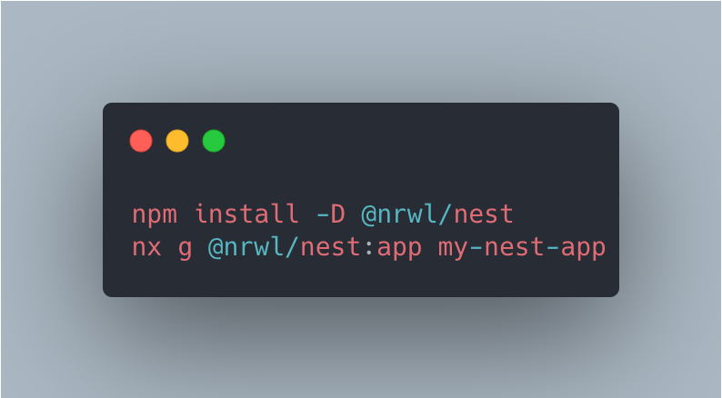

## How to build scalable project with monorepo

There are many ways to create and mantain software projects. If it comes to the code respository itself and code managing a classic approach is to create one repository per each project and it worked that way for many years. But what if the code we write in one project can be used in other projects as well? Or if the logic for frontend and backend code is duplicated and consists of the same rules and statements? Monorepos come to the rescue.

## What, why and when

Monorepos are modern approach for building and maintaining complex apps, which consist of multiple layers and shared logic. Almost every bigger company uses monorepos in one way or another, let it be Google, Facebook or Airbnb. Monorepos are widely used in popular javascript libraries like Jest, Create React App or React Query (nowadays known as Tanstack Query). Google codebase is speculated to have 80 terabytes of raw code, which is held in one big repository mantained by [Bazel](https://bazel.build/)

## Pros & cons

The main advantage of monorepo is we have one source of truth. Instead of having a lot of repositories with their own codebase and configs we have single repository, enabling us for code sharing and reusability. Monorepo also simplifies dependency management as we can have single configuration file for all the projects within it. As with everything monorepos also have their disadvantages. Main one is code discovery - with growing codebase there will be a point in time where searching for code for reuse will be much harder due to codebase size itself. Another disadvanatage is access restriction - every git service provider or git itself provides access on repository level which means every member who has access to the repo will have access to the whole codebase.

## Monorepo tooling

Quick google search will provide us bunch of results regarding monorepos. We have yarn workspaces, rush, lerna, bazel, turorepo or nx to name some of them. We will focus on the last one: nx

Nx is developed by Nrwl and started as pure monorepo tool, today it evolved more to be a build system and provides bunch of tools to structure our code. It helps to build, test and deploy apps. It has support for Typescript, React, Angular, Nest.js, Next.js and many more. If it doesn't support technology out of the box we can utilize generators which can be configured to build any type of project. On top of that nx has great CLI which can speed up development and deployment greatly.

Nx also utilized caching and robust dependency management, which speeds up builds and deployments. Nx builds a graph of dependencies and rebuilds only parts of the monorepo which were affected by changes in some cases reducing build times by over 70%.

## Let's build a monorepo

Let's jump into some examples. Let's say we want to create some frontend and backend services using nx and utilizing next js for frontend and nest js for backend part. We can create our workspace with one command:

Nx will prompt us for a workspace name, workspace type (can be raw workspace or with settings for frontend apps, backend apps or even npm libraries)

Then to create Next.js app:

And Nest.js app:

Depending on the app and library used nx will prompt us for different things, for example next js app will ask us for styling we want to use with the frontend, we can choose from pure css, less, sass, styled components and more. Nest js will ask us for typescript support and so on

Using Nx.js we don't have to worry about unit tests or e2e tests configuration, it is wired in automatically by the library and is ready to use and write more tests straight ahead.

Last but not least, Nx CLI provides us with bunch of commands useful for testing, build or even app deployment. To run app in development mode all we have to do is:

This will conclude the idea of monorepo and why we should or should not use it. Many companies use monorepos for their codebases and they have plethora of use cases. Nowadays there are far more pros than cons regarding monorepo usage.
